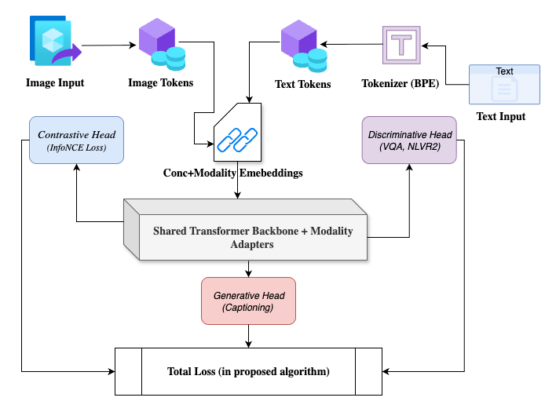
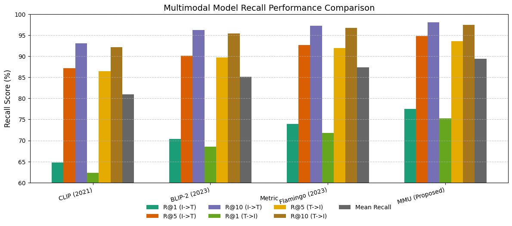
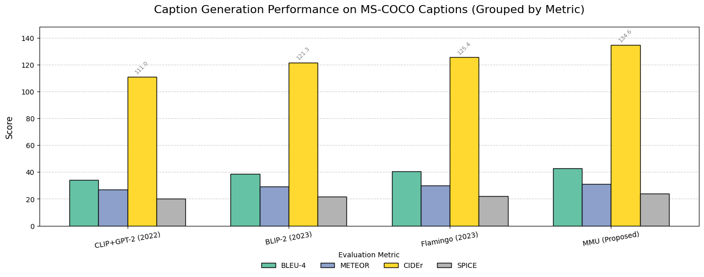

# Multimodal-Unit

Official implementation of Multi-Modal UNIT (MMU) — a unified transformer for joint language–vision understanding and content generation.
# 🧠 Multi-Modal UNIT (MMU)

Official implementation of the paper:  
**"Unified Transformer Framework for Integrated Language–Vision Understanding and Content Generation"**  
Submitted to *Springer Nature 2025*

---

## 🔍 Overview
**Multi-Modal UNIT (MMU)** is a unified transformer architecture designed to bridge visual and linguistic understanding within a **single-stream framework**.  
Unlike traditional dual-encoder approaches that treat text and image separately, MMU introduces **lightweight modality adapters** that project visual and textual embeddings into a shared representational space.  
Through **shared attention layers** and a **hybrid optimization strategy** combining contrastive and generative objectives, MMU achieves both strong accuracy and high computational efficiency across multimodal tasks.

---
## 🧠 Model Architecture

  

*Figure 1. The overall architecture of Multi-Modal UNIT (MMU).*

## 🧩 Key Contributions
- ✅ **Unified single-stream transformer** for both language and vision processing.  
- 🧠 **Lightweight modality adapters** for efficient feature alignment.  
- 🔄 **Hybrid objectives** integrating contrastive (understanding) and generative (captioning/reasoning) training.  
- 📊 **Consistent performance** across COCO, Flickr30k, VQAv2, and NLVR2 benchmarks.  
- ⚡ **210M parameters** with **70 ms per-sample inference latency**, achieving a strong accuracy–efficiency balance.

## 🧩 Result Comparisions

  

*Figure 2. Recall Performance Comparison of Evaluation Metrics*

  

*Figure 3. Caption Generation Performance on Evaluation Metrics*
- MMU achieves the highest captioning scores, showing a +9.2 gain in CIDEr compared to Flamingo as shown in Fig.3. This highlights how effective the unified architecture with modality adapters and hybrid losses is. Qualitative results show that MMU produces more contextually relevant captions and manages object relationships better than the baselines.

---
## ⚖️ License & Copyright
This project is licensed under the **MIT License**.  
© 2025 **ANUJ ATTRI**. All rights reserved.  
When using this code or referencing results, please cite this repo.

---

## 📚 Citation

If you use this repository or refer to our work, please cite:

Anuj Attri, HariOm (2025). *Unified Transformer Framework for Integrated Language–Vision Understanding and Content Generation*  
Zenodo. [https://doi.org/10.5281/zenodo.17499887](https://doi.org/10.5281/zenodo.17499887)

